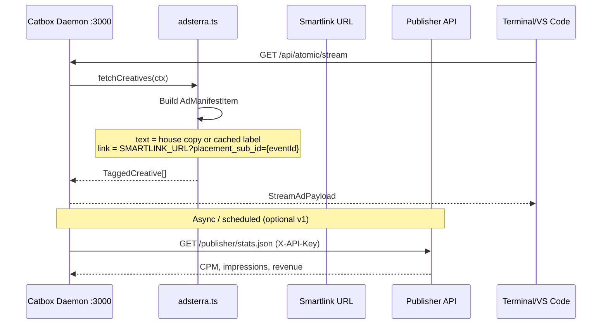

# Prompt Maestro: Integración Adsterra (Smartlink + Publisher API) para daemon terminal

**Fecha**: 2026-06-19  
**Solicitud original**: Usar Adsterra Ads API para fetch programático de creativos sin website/landing page; servir ads en terminal vía daemon Catbox — arquitectura API-driven pura.  
**Estado**: ejecutado
---

## Contexto

### Lo que el usuario quiere

- Token desde Settings → API
- Fetch programático de ads
- Sin website ni landing page como superficie de render
- Delivery en terminal vía daemon Catbox (`/api/atomic/stream`, extensión, Termux)

### Hallazgo crítico de investigación

Adsterra expone **dos APIs distintas**. No son intercambiables:

| API | Rol | Base URL | Métodos | ¿Sirve creativos a Catbox? |
|-----|-----|----------|---------|----------------------------|
| **Advertiser API** (“Ads API”) | Media **buyer** — gestionar campañas, banners, bids | `https://api3.adsterratools.com/advertiser` | GET, POST, PATCH | **No** — Catbox no compra tráfico |
| **Publisher API** | **Publisher** — dominios, placements, estadísticas | `https://api3.adsterratools.com/publisher` | GET solo | **Parcial** — stats/placements, **no** devuelve creativos JSON |

**Conclusión**: No existe un endpoint público documentado tipo `GET /creatives` que devuelva `{ text, link }` para terminal. La vía documentada para superficies sin browser es **Smartlink / Direct Link** (URL única), no el Advertiser API.

### Alineación con notas internas (`facutest.txt`)

- Formato correcto: **Direct Link (Smartlink)** — URL server-side, sin iframe/popup
- Publisher API: reporting y reconciliación (`stats.json`, `domains`, placements)
- Onboarding: preferir **Smartlinks → Add Smartlink** sobre Websites → Add website
- Catbox MVP: Adsterra como **click fallback**, no CPM inventory principal
- Pedir confirmación a soporte antes de tráfico real en placement no-browser

### Estado actual Catbox

- Patrón de adaptadores en `src/server/providers/` (`carbon.ts`, `buysellads.ts`, …)
- `ProviderType` en `src/types.ts` — **no incluye `adsterra`**
- Stream: `selectStreamAd()` → `fetchProviderCreatives()` → `AdManifestItem` `{ id, text, link, hash }`
- Daemon: Express `:3000` `/api/atomic/stream`; extensión y Termux consumen payload
- Reporting: `reportProviderEvent()` → `data/provider-reports.jsonl`

---

## Objetivo

Integrar Adsterra como proveedor **`adsterra_smartlink`** en Catbox con arquitectura híbrida API-driven:

1. **Delivery runtime**: Smartlink URL configurada (env o provider record) — resolución server-side en el daemon
2. **Operaciones/reporting**: Publisher API con `X-API-Key` para listar placements y pull de stats CPM/revenue
3. **Sin website como superficie de ad** — landing solo como URL de proyecto si Adsterra la exige en onboarding (transparente en descripción)

---

## Alcance

### Incluido

- Nuevo `ProviderType`: `adsterra_smartlink`
- Adaptador `src/server/providers/adsterra.ts`
- Registro en `src/server/providers/index.ts` y seed opcional en `seedNetworks.ts`
- Env vars: `ADSTERRA_API_KEY`, `ADSTERRA_SMARTLINK_URL`, `ADSTERRA_PLACEMENT_ID`, `ADSTERRA_DOMAIN_ID`
- Cliente HTTP mínimo: `GET https://api3.adsterratools.com/publisher/stats.json` (reconciliación)
- Mapeo a `AdManifestItem` para terminal (texto sponsorship + link Smartlink con `placement_sub_id` único por impresión/dev)
- Fixture local `data/provider-manifests/adsterra.json` para dev/mock
- Tests en `adapters.test.ts` con fixture
- Reporting hook en `reporting.ts` (dry-run por defecto; audit JSONL)
- Doc en `docs/reference/adsterra-integration.md`
- Changelog en `docs/changelogs/`

### Excluido

- Integración Advertiser API (rol incorrecto)
- Popunder, Banner, Social Bar (browser-only)
- Landing page deploy (tarea separada si onboarding lo exige)
- Auth nueva en Catbox
- Refactor de `App.tsx` o `server.ts` más allá de wiring mínimo
- Tráfico real hasta confirmación de soporte Adsterra

---

## Arquitectura propuesta



### Mapeo Smartlink → AdManifestItem

```typescript
{
  id: `adsterra_${placementId}_${subId}`,
  text: process.env.ADSTERRA_DISPLAY_TEXT || "Sponsored — tap to explore",
  link: `${ADSTERRA_SMARTLINK_URL}?placement_sub_id=${subId}`,
  hash: hashAdCore({ id, text, link })
}
```

- `placement_sub_id`: `event_id` o `developerId_surface_timestamp` para stats API grouping
- Impresión en terminal = mostrar texto; click = abrir link (Smartlink redirect)
- **No** hacer fetch del Smartlink en cada impresión (evita inflar clicks); solo en click o con política explícita documentada

### Env vars

| Variable | Requerido | Uso |
|----------|-----------|-----|
| `ADSTERRA_API_KEY` | Prod | Header `X-API-Key` — Publisher API |
| `ADSTERRA_SMARTLINK_URL` | Prod | URL base del Smartlink (dashboard) |
| `ADSTERRA_PLACEMENT_ID` | Opcional | Filtro stats |
| `ADSTERRA_DOMAIN_ID` | Opcional | Filtro stats |
| `ADSTERRA_DISPLAY_TEXT` | Opcional | Copy en terminal (≤75 chars) |
| `CATBOX_REPORT_DRY_RUN` | Dev | Sin HTTP outbound |

---

## Archivos previstos

| Archivo | Acción |
|---------|--------|
| `src/types.ts` | Añadir `"adsterra_smartlink"` a `ProviderType` |
| `src/server/providers/adsterra.ts` | **Nuevo** — adaptador |
| `src/server/providers/index.ts` | Registrar adaptador |
| `src/server/providers/seedNetworks.ts` | Entrada seed opcional (inactive hasta env) |
| `src/server/providers/reporting.ts` | Case `adsterra_smartlink` |
| `src/server/providers/reporting/adsterra.ts` | **Nuevo** — stats pull / audit |
| `data/provider-manifests/adsterra.json` | Fixture dev |
| `src/server/providers/adapters.test.ts` | Tests fixture + env mock |
| `.env.example` | Documentar vars |
| `docs/reference/adsterra-integration.md` | **Nuevo** — guía onboarding |
| `docs/changelogs/integracion-adsterra-smartlink_2026-06-19.md` | Changelog |

---

## Plan de implementación

### Fase 1 — Adaptador core (sin tráfico real)

1. Extender `ProviderType` con `adsterra_smartlink`
2. Implementar `adsterra.ts`:
   - Si faltan env en live mode → `[]`
   - Si mock/dev → `loadLocalFixture("adsterra")`
   - Si env presentes → construir `AdManifestItem` con Smartlink + sub_id
3. Registrar en `ADAPTERS` array
4. Fixture JSON + tests

### Fase 2 — Publisher API client

1. Función `fetchAdsterraStats(apiKey, domainId, placementId, dateRange)`
2. `GET .../publisher/stats.json` con headers correctos
3. Manejo errores 401/403/422 según docs Adsterra
4. **No** bloquear stream si API falla — degrade graceful

### Fase 3 — Reporting y docs

1. `reporting/adsterra.ts` — log a JSONL; opcional stats snapshot
2. `docs/reference/adsterra-integration.md`:
   - Cómo obtener token (Publisher, Settings → API)
   - Smartlink vs Advertiser API (tabla)
   - Copy para soporte Adsterra (non-browser placement)
   - Orden: Smartlink → confirmar → env vars → tráfico
3. Changelog

### Fase 4 — Verificación

```bash
npm run lint
npm test
npm run dev
npm run test:pre-ship
# Manual: GET /api/atomic/stream?mock=1 con provider adsterra seed
```

---

## Criterios de aceptación

- [ ] `adsterra_smartlink` aparece en registry de adaptadores
- [ ] Con solo fixture: stream devuelve creativo Adsterra en selección ponderada
- [ ] Con `ADSTERRA_SMARTLINK_URL`: link incluye `placement_sub_id` único
- [ ] Publisher API client no rompe stream si falla
- [ ] Tests pasan; pre-ship green
- [ ] `.env.example` documentado
- [ ] Doc aclara que **Advertiser API no es el path de publisher**

---

## Riesgos y mitigaciones

| Riesgo | Mitigación |
|--------|------------|
| Usuario usa Advertiser token por error | Doc + validar endpoint publisher en health check |
| Smartlink fetch en impresión = click fraud | Solo construir URL; no HTTP follow hasta click |
| Adsterra rechaza placement CLI | Contactar soporte antes de tráfico; fixture hasta aprobación |
| Violación ToS non-browser | Copy transparente; opt-in; sin popups |
| Confusión CPM vs click | Tratar como click fallback en ledger; no simular CPM gross como Carbon |

---

## Prerrequisitos manuales (usuario)

1. Cuenta **Publisher** Adsterra (no Advertiser)
2. Settings → API → GENERATE NEW TOKEN → `ADSTERRA_API_KEY`
3. Smartlinks → Add Smartlink → copiar URL → `ADSTERRA_SMARTLINK_URL`
4. (Opcional) Email a soporte con copy de `facutest.txt` §3
5. **No** enviar tráfico real hasta confirmación

---

## Changelog

**Sí** — nuevo provider type, adaptador, reporting, docs, tests → `docs/changelogs/integracion-adsterra-smartlink_{fecha}.md`

---

## Notas para el ejecutor (post-Procede)

- Seguir patrón `carbon.ts` + `directSponsor.ts` (fixture fallback, live mode)
- Reutilizar `hashAdCore` de `providers/hash.ts`
- `isLiveCpmMode()` — en live sin Smartlink URL, return `[]` no fixture
- Extensión ya consume `link` en click — no cambiar contrato `StreamAdPayload`
- Referencia API: `https://api3.adsterratools.com/publisher` + `X-API-Key` header
- Advertiser API base `.../advertiser` — **no implementar** salvo requisito explícito futuro
